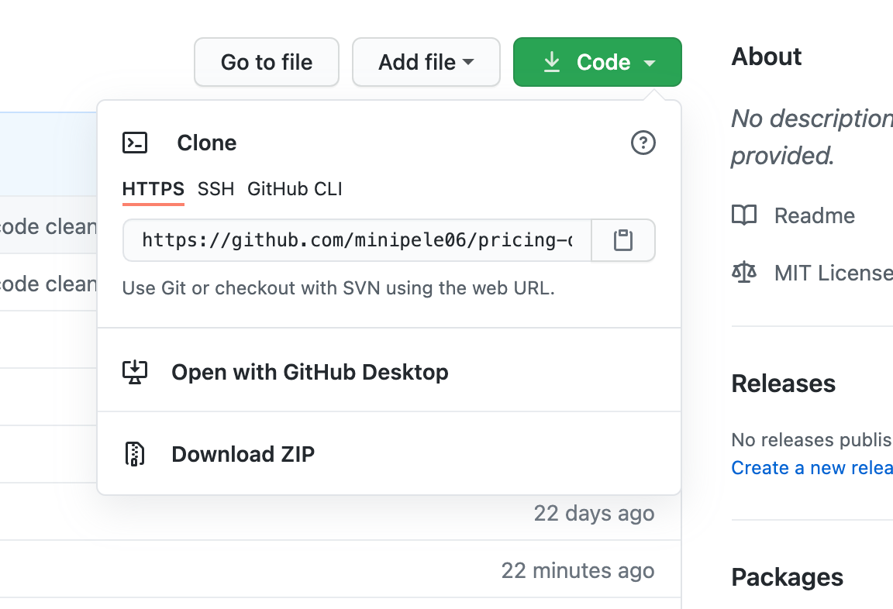
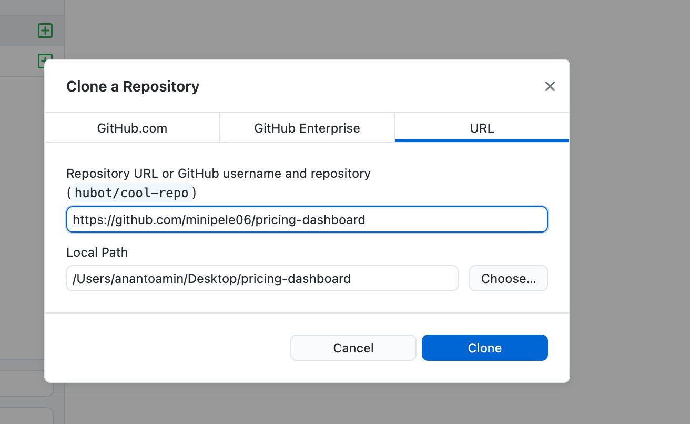
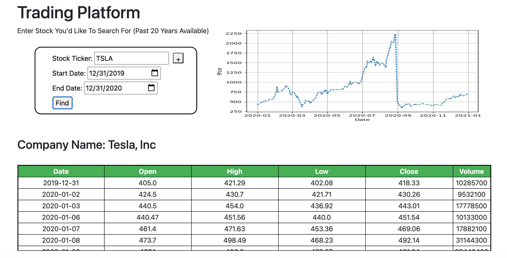
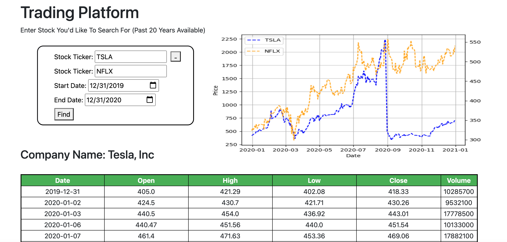
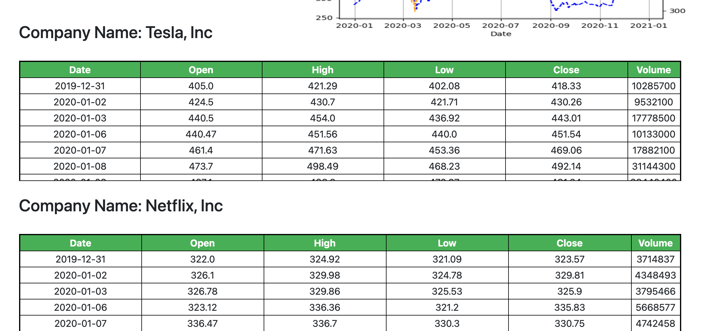

# pricing-dashboard
 
## Functionality

This web app allows you to search for stock price history for one or two stock and view them in a graph or in a table. The price history includes:

* Date
* Open
* High
* Low
* Close
* Volume

## Setup

### Repo Setup
Use [GitHub](https://github.com/minipele06/pricing-dashboard) to clone the project repository for the Stock Market Simulator. Use GitHub Desktop software or the command-line to download or "clone" it onto your computer. 

You will be prompted to choose a local path to save the repository. Choose a familiar download location like the Desktop. An example would be to save to a local path such as /Desktop/pricing-dashboard. 

After cloning the repo, navigate there from the command-line:

>cd ~/Desktop/pricing-dashboard

### Environment Setup

If you have never or don't have Conda installed, please visit the following page and follow the instructions: https://conda.io/projects/conda/en/latest/user-guide/install/index.html

Once you have installed, create and activate a new Anaconda virtual environment:

>conda create -n price-env python=3.7 # (first time only)

>conda activate price-env

From within the virtual environment, install the required packages specified in the "requirements.txt" file:

>pip install -r requirements.txt

## Instructions
From within the virtual environment, confirm your ability to run the web app from the command-line:

Mac
>FLASK_APP=web_app flask run

PC
>export FLASK_APP=web_app # first time, to set the env var
>flask run # subsequent times

If you receive a message stating the following:

>Running on http://127.0.0.1:5000/ (Press CTRL+C to quit)

Then you have succesfully launched the web app. Go to you internet browser and enter the following adress to access the app locally http://127.0.0.1:5000/pricefind. 

## Step-by-Step Guide

As stated above, once you receive a message in your terminal that the web app is running locally, you may then navigate to the local address.

### Price Find

The price find page is the main landing page where you can perform all of the functionality of the web app. This page allows you to search one stock ticker at a time. Hitting the "+" button allows you to search for two tickers at once and compare them.

There is some validation upon the inputs. The stock ticker is checked that it includes 1-5 letters by utilizing regex. The dates are checked so that the start date is not after the end date and that either date is not in the future.

The data will be pulled from the Alphavantage API and then added to the SQL database if it does not already exist. The ticker symbol is also added to the ticker table if it does not already exist along with the company name, sector, and industry. The data is then displayed on the web page in a table and a graph. 

Here are some examples of the output:

Example 1

Example 2a

Example 2b

## Minimum Viable Product

The following program was created as a minimum viable product and therefore is missing some functionality. Some of said missing functionality include:

* Technical Indicators
* Sentiment Analysis such as Twitter feeds
* Ability for users to create a watchlist that they may track 